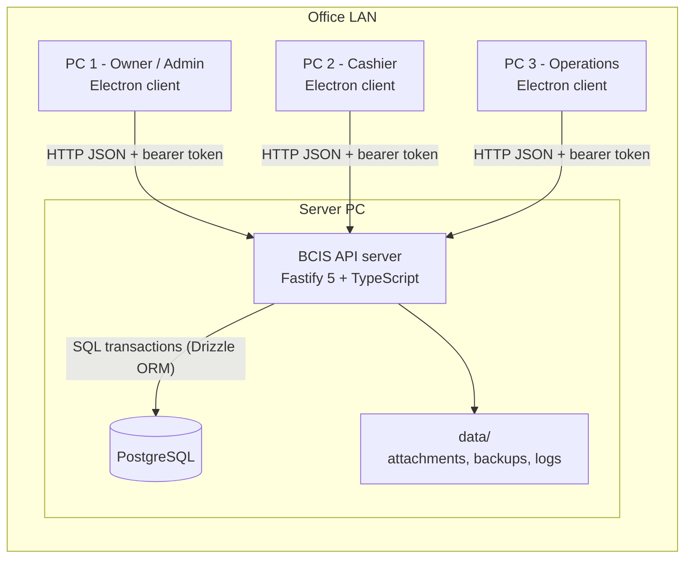
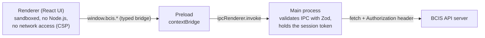
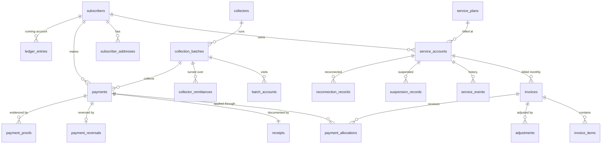
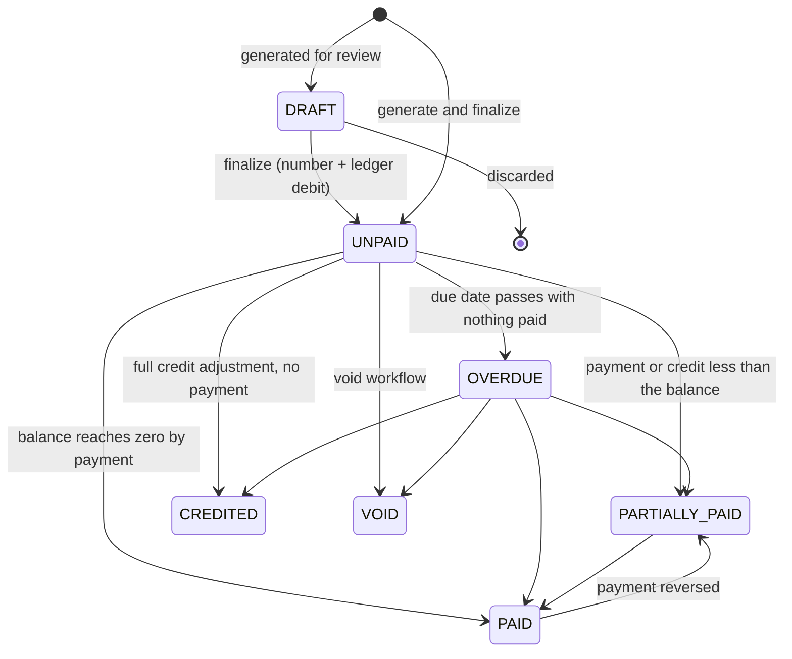

# BCIS Subscription Billing and Collection System

**Technical Documentation**

Subscription billing, collection and subscriber ledger system for Bukidnon Cable and Internet Services.

Version 1.0.0 · Electron desktop clients → Fastify API → PostgreSQL

# 1. Business Analysis

## 1.1 The business

Bukidnon Cable and Internet Services (BCIS) sells Internet, Cable and Combo subscriptions. Subscribers are billed every month and pay in one of three ways: at the office, to a field collector who visits house to house, or by GCash (the customer sends a screenshot of the transaction to the company Facebook Page). Three office PCs must use the system at the same time.

## 1.2 Problems the system solves

| Problem in the manual process | How the system addresses it |
|---|---|
| Balances are recomputed by hand and drift over time | Every charge and payment is an entry in an append-only subscriber ledger; the balance is always recomputed from those entries |
| Partial and advance payments are hard to track | Payments are allocated to invoices through allocation records; any excess is kept as advance credit and applied automatically to later invoices |
| A GCash screenshot can be credited twice, or credited without checking | Proofs go into a verification queue; only an authorized verifier can post them; a reference number can back only one posted payment |
| Collector cash is not reconciled | Collection batches record what was collected, what was remitted and the exact shortage or overage, with a mandatory explanation |
| Mistakes are "fixed" by editing or deleting records | Posted payments are reversed, invoices are voided or adjusted; nothing financial is deleted and every change is audited |
| The owner cannot see receivables | Dashboard, AR aging, overdue list, suspension candidates and 16 exportable reports |
| Three PCs sharing one file corrupt data | One central API server and PostgreSQL; the PCs are clients only |

## 1.3 Users and roles

| Role | Purpose | Sensitive permissions it does **not** have |
|---|---|---|
| Owner / Super Admin | Everything, including users, settings, backup and restore | — |
| Administrator | Subscribers, plans, services, billing, collections, reversals, closing batches | users, settings, backup, restore |
| Cashier | Find subscriber, receive payment, print receipt, record GCash proofs | reverse payment, verify GCash, manual allocation, billing |
| Collection Supervisor | Areas, collectors, batches, remittance, reconciliation | close batch, reverse payment, billing |
| Accounting / Auditor | Read-only finance, reports, audit trail | every mutation |
| Technician | Service accounts, suspensions, complete reconnection work | all financial data |
| Read-only Viewer | Dashboards and reports | every mutation, audit trail |

The complete matrix (34 permissions × 7 roles) is defined in `source/shared/src/permissions.ts`, loaded into the database by the base seed, shown in **Administration › Roles & Permissions**, and asserted by the acceptance tests.

# 2. Architecture

## 2.1 Overview

The three office PCs never open the database. All reads and writes go through the API, so validation, authorization, transactions and audit logging are applied in exactly one place.

## 2.2 Inside one desktop client

* `contextIsolation: true`, `nodeIntegration: false`, `sandbox: true`, `webSecurity: true`.
* The renderer can only call the functions exposed as `window.bcis` (see section 7.2). `ipcRenderer` itself is not exposed.
* The session token is kept in main-process memory only. The renderer never sees it, so script running in the page could not steal it.
* A Content-Security-Policy in production builds forbids remote scripts and any network connection from the renderer (`connect-src 'none'`).
* Navigation to other origins, new windows, `<webview>` and all permission requests are denied.

## 2.3 Repository layout

| Path | Contents |
|---|---|
| `source/shared` | Pure domain rules (money, allocation, invoice status, aging, reconciliation), permission matrix, Zod request schemas, response types. Used by both API and UI. |
| `source/api` | Fastify server: `routes.ts` (authorize + validate + delegate), `modules/*/service.ts` (business rules and SQL), `db/schema.ts` (Drizzle), `lib` (audit, sequences, passwords, attachments). |
| `source/desktop` | Electron `main`, `preload`, and the React renderer (`components`, `pages`, `lib`). |
| `database/migrations` | SQL migrations generated by Drizzle Kit, plus a hand-written migration for guard triggers and search indexes. |
| `database/seeds` | `base.ts` (roles, permissions, sequences), `demo.ts` (synthetic demo dataset), `run.ts` (CLI). |
| `tests/acceptance` | API-level acceptance tests AT-01 to AT-12 and supporting workflows. |
| `tests/e2e` | Playwright tests that drive the real Electron app and capture screenshots. |
| `docs`, `reports-samples`, `release` | Documentation, sample report output, installer output. |

## 2.4 Module boundaries

Business rules live in services and in `@bcis/shared`, never in React components or route handlers:

* **Route handler** — three steps only: `app.can(permission)`, `Schema.parse(input)`, call the service.
* **Service** — opens the transaction, takes locks, applies the rule, writes the audit record.
* **Shared domain function** — pure calculation with no I/O (for example `allocateOldestFirst`), unit tested and reused by the UI for previews.
* **React page** — displays data and collects input. The allocation preview on the Receive Payment screen is computed by the server (`POST /payments/preview`) using the same function the posting uses.

# 3. Technology Decisions

| Layer | Choice | Reason |
|---|---|---|
| Desktop shell | Electron 44, electron-vite 5, electron-builder 26 | Windows desktop app and NSIS installer from one TypeScript codebase |
| UI | React 19, TypeScript strict, Tailwind CSS 4, shadcn-style components on Radix primitives | Typed UI; one consistent design system built from the brief's colour tokens |
| Tables / server state | TanStack Table 8, TanStack Query 5 | Server-side paging, sorting and search; cached, refetched queries |
| Forms / validation | React Hook Form 7 + Zod 4 | The same Zod schema validates the form in the client and the request on the server |
| API | Fastify 5 | Small, fast, typed; one process serves all three PCs |
| Database | PostgreSQL 17 | Real concurrent transactions, row locks, constraints, partial unique indexes, triggers |
| ORM / migrations | Drizzle ORM 0.45 + Drizzle Kit | Typed schema as code; SQL migrations kept in the repository |
| Reports | pdfmake 0.3 (PDF), ExcelJS 4 (XLSX) | Server-side rendering so every PC produces identical output |
| Tests | Vitest 5, Playwright 1.63 (Electron) | Unit, API integration and desktop end-to-end |
| Logging | Pino 10 | Structured JSON logs with secret redaction |

**Why PostgreSQL instead of a shared SQLite file.** A SQLite file on a network share relies on file locking over SMB, which is unreliable and is a known cause of database corruption; it allows only one writer at a time; and every PC would need direct write access to the whole database file, so no server-side authorization would be possible. PostgreSQL is a server: it gives row-level locking, true concurrent transactions, constraints enforced centrally, and the clients only ever talk to the API.

**Money.** Every amount is an integer number of centavos stored as `BIGINT` (₱999.00 is `99900`). No floating-point arithmetic is used for money anywhere: user input is parsed by string arithmetic (`parseMoney`), and an ESLint rule bans `parseFloat`. Spreadsheet and PDF output divide by 100 only for display.

**Password hashing.** `scrypt` (Node.js built-in) with N=32768, r=8, p=3 and a random 16-byte salt per password; the parameters are stored with the hash. No native add-on is needed, which keeps deployment simple.

# 4. Modules

| Module | Service file | Responsibilities |
|---|---|---|
| Authentication | `modules/auth/service.ts` | Login, lockout after failed attempts, opaque bearer sessions (only the SHA-256 of the token is stored), idle lock, unlock, logout, change password |
| Users and roles | `modules/users/service.ts` | User CRUD, role assignment, password reset (revokes sessions) |
| Master data | `modules/masterdata/service.ts` | Plans (price changes apply to future billing), collection areas, collectors and their area assignments |
| Subscribers | `modules/subscribers/service.ts` | Registration, addresses, search, status changes (never deleted) |
| Services | `modules/services/service.ts` | Service accounts, plan change, suspension, reconnection workflow, termination, service history |
| Billing and ledger | `modules/billing/*` | Monthly generation, draft/finalize, invoice numbering, void, adjustments, advance-credit application, ledger queries |
| Payments | `modules/payments/service.ts` | Allocation preview, posting, receipts, reversal |
| GCash | `modules/gcash/service.ts` | Proof submission, duplicate detection, verify (posts payment), reject |
| Collections | `modules/collections/service.ts` | Route sheets, batches, collection recording, remittance, reconciliation, closing |
| Receivables | `modules/receivables/service.ts` | Outstanding, overdue, aging, suspension candidates |
| Dashboard | `modules/dashboard/service.ts` | KPIs and chart data |
| Reports | `modules/reports/*` | 16 report definitions and the PDF/XLSX/CSV renderers |
| Administration | `modules/admin/*` | Audit log, integrity check, backup, verify, restore, global search |

# 5. Data Model

The entity-relationship diagram is in `docs/erd.pdf` (generated from the foreign keys of the live database). The full data dictionary is Appendix A.

## 5.1 Core relationships

## 5.2 Integrity enforced by the database

These rules hold even if application code has a bug or someone uses a SQL prompt.

| Rule | Mechanism |
|---|---|
| Unique subscriber, service account, invoice, receipt, adjustment, reversal, batch and remittance numbers | `UNIQUE` constraints |
| One live invoice per service account and billing period | Partial unique index `invoices_account_period_uq` (`WHERE status <> 'VOID'`) |
| One posted payment per GCash reference | Partial unique index on `upper(reference_no)` `WHERE method = 'GCASH' AND status = 'POSTED'` |
| A payment is reversed at most once; a retried request posts once | `UNIQUE` on `payment_reversals.payment_id` and `payments.idempotency_key` |
| `balance = total + adjustments - paid`, never negative | `CHECK` constraints on `invoices` |
| A ledger entry is exactly one side | `CHECK ((debit = 0) <> (credit = 0))` |
| Unapplied credit never exceeds the payment | `CHECK` on `payments` |
| A reconciled or closed batch carries `difference = remitted - collected`, the matching variance type, and a reason when not balanced | `CHECK collection_batches_variance_ck` |
| Payments, allocations, receipts, reversals, ledger entries, adjustments, remittances and audit rows cannot be deleted | `BEFORE DELETE` triggers (`bcis_forbid_delete`) |
| Ledger entries, audit rows, reversals and adjustments cannot be updated | `BEFORE UPDATE` triggers (`bcis_forbid_update`) |
| A posted payment's amount, date, method, reference and subscriber cannot be edited; REVERSED is final | Trigger `bcis_guard_payment` |
| Receipt numbers cannot be reassigned; a void receipt cannot be re-issued | Trigger `bcis_guard_receipt` |
| A finalized invoice's lines and totals cannot change; it cannot be deleted | Triggers `bcis_guard_invoice`, `bcis_guard_invoice_item` |
| Every owned record references its owner | Foreign keys on all child tables |

## 5.3 Indexes for the target volumes

The target is 20,000 subscribers, 500,000 invoices, 500,000 payments and 1,000,000 ledger entries. Lists are always paged on the server (25–200 rows) and never loaded whole into the client.

* Subscriber search: trigram GIN indexes on name, contact number and address (`pg_trgm`) make "contains" searches fast; b-tree on account number, area, collector and status.
* Invoices: `(due_date, status)`, `(subscriber_id)`, `(billing_period)` and a partial index on open invoices `(subscriber_id, due_date) WHERE balance > 0`.
* Payments: `(subscriber_id, payment_date)`, `(payment_date)`, `(reference_no)`, `(collector_id)`, `(collection_batch_id)`.
* Ledger: `(subscriber_id, entry_date, id)` — exactly the order the running balance is computed in.
* Audit: `(at)`, `(entity_type, entity_id)`, `(actor_id, at)`, `(subscriber_id)`.

# 6. Financial Rules

## 6.1 Invoice life cycle

The status is derived by one function, `deriveInvoiceStatus` in `@bcis/shared`, from the amounts and the due date. Receivable aging never relies on the status: it is always computed from due date and balance, so a partially paid invoice that is past due is still aged correctly.

## 6.2 Monthly billing

* One invoice per **active** service account whose billing start date is on or before the end of the period. Suspended and terminated accounts are not billed.
* Line items: subscription at the account's **current rate** (copied onto the invoice), installation fee on the first invoice, optional late-payment penalty, optional monthly discount.
* A plan price change updates the rate of its service accounts for **future** billing; invoices already generated keep their amounts because the price is stored on the invoice line.
* **No duplicates:** the insert uses `ON CONFLICT DO NOTHING` against the partial unique index. Running the generation twice, or from two PCs at once, creates each invoice exactly once (AT-11, AT-09).
* Each invoice (header, lines, number, ledger debit, credit application) commits in its own transaction, so a run that is interrupted leaves only complete invoices and can simply be run again.
* Limitation: no proration — a service is billed for the whole month in which its billing starts.

## 6.3 Payment posting and allocation

A payment is posted in **one database transaction**:

1. lock the subscriber row (`SELECT … FOR UPDATE`) — serializes all financial activity of that subscriber;
2. lock the subscriber's open invoices, oldest first;
3. compute the allocation (`allocateOldestFirst`, or `allocateManually` for an authorized override);
4. insert the payment and its allocation rows; update each invoice's paid amount, balance and status;
5. take the next receipt number and insert the receipt;
6. post one ledger credit for the full amount;
7. write the audit record.

If anything fails, or the server stops halfway, PostgreSQL rolls the whole transaction back: there is never a payment without its receipt and ledger entry, and the receipt number is not consumed. If the client retries, the idempotency key guarantees the payment is posted once.

**Default allocation rule — oldest unpaid invoice first:** earliest due date, then earliest invoice date, then lowest id.

**Partial payment** is simply an allocation smaller than the invoice balance: one `payment_allocations` row for ₱500.00 against a ₱999.00 invoice leaves `amount_paid = 50000`, `balance = 49900`, status `PARTIALLY_PAID`.

**Advance payment policy:** money beyond the open invoices is not lost and not forced onto anything. It stays on the payment as `unapplied_amount` (the subscriber's advance credit) and the ledger balance goes negative by that amount. When later invoices are finalized, the credit is applied automatically — oldest payment first, oldest invoice first — as allocation rows of type `CREDIT`. Invariant, checked by the integrity check: for every posted payment, *allocations + unapplied = amount*.

**Manual allocation** requires the `payment.allocate_manual` permission; each line must target an open invoice of the same subscriber and may not exceed its balance.

## 6.4 Reversal instead of deletion

`POST /payments/:id/reverse` (permission `payment.reverse`, reason required) in one transaction:

* marks the payment `REVERSED` (the row stays);
* marks its allocations reversed and restores each invoice's paid amount, balance and status;
* voids the receipt — the number stays reserved forever and is never issued again;
* inserts a `payment_reversals` row (who, when, why) and a ledger **debit** that offsets the original credit;
* writes an audit record with old and new values.

Deleting would destroy the evidence of what happened and leave gaps in receipt numbering; reversing keeps the full history auditable, which is what an auditor and the tax authority expect.

## 6.5 Subscriber ledger

`ledger_entries` is append-only: an invoice posts a debit, a payment posts a credit, a reversal posts a debit, an adjustment posts either, a void posts a credit. The running balance is **never stored**; it is recomputed every time with a window function ordered by `(entry_date, id)`, so the same entries always give the same balances.

**Proof that the ledger is right** — the integrity check (`GET /integrity-check`, also run after every restore and by the demo seed) verifies ten independent rules from the raw tables, including: for every subscriber, *ledger balance = open invoice balances − unapplied credit*; every finalized invoice and every payment appears in the ledger exactly once for the right amount; invoice paid amounts equal their non-reversed allocations.

## 6.6 Document numbering

`number_sequences` holds one row per document type. `nextNumber()` runs `UPDATE … SET next_value = next_value + 1 … RETURNING` inside the posting transaction. The row lock makes concurrent issuers queue, so two PCs can never receive the same number; because it is part of the transaction, a rollback returns the number (no gaps). Formats: `BCIS-00001`, `SA-000001`, `INV-000001`, `RCPT-000001`, `ADJ-00001`, `REV-00001`, `CB-00001`, `REM-00001`.

## 6.7 GCash verification policy

1. Staff records the proof: reference number, sender, amount, date and the image. **Nothing is posted.**
2. The system lists every other proof or payment with the same reference number (warning).
3. A user with `gcash.verify` compares the proof with the real GCash transaction history and verifies or rejects it; the verifier and time are stored.
4. Verification posts and allocates the payment in the same transaction as the status change.
5. A reference that already backs a **posted** payment is **blocked** — in the service and by the unique index. Reversing that payment frees the reference.
6. Users without `gcash.verify` cannot post a GCash payment directly from Receive Payment.

## 6.8 Collection batches and reconciliation

Life cycle: `OPEN → IN_PROGRESS → SUBMITTED → REMITTED → RECONCILED → CLOSED`.

* Creating a batch snapshots every assigned subscriber in the area with an amount due (current bill, arrears, total).
* Each collection is a normal posted payment tagged with the batch and collector.
* Only **cash** must be remitted; GCash and other non-cash collections are reported separately.
* *difference = cash remitted − cash collected.* Zero is `BALANCED`, negative is `SHORTAGE`, positive is `OVERAGE`.
* A batch that is not balanced **cannot be reconciled without a recorded reason**, and a batch cannot be closed unless it is reconciled. Closing needs a different permission (`collection.close`) and an explicit confirmation. The database `CHECK` refuses a "balanced" result for unequal amounts.

## 6.9 Suspension and reconnection

* Settings: grace period (default 15 days) and suspension threshold (default 2 unpaid invoices beyond the grace period).
* Suspending records reason, effective date, arrears at suspension and the approver.
* With "reconnection requires settled arrears" on, a reconnection request is refused until the overdue invoices are paid. The plan's reconnection fee is billed as a one-time invoice (so it flows through the ledger), a technician can be assigned, and completion sets the account back to Active.
* Every state change is written to `service_events`.

# 7. Interfaces

## 7.1 HTTP API

All routes are under `/api`. Requests and responses are JSON. Every route except `/health` and `/auth/login` needs `Authorization: Bearer <token>`. Errors have one shape: `{ "error": { "code", "message", "fields"? } }`.

| Area | Endpoints | Permission |
|---|---|---|
| Health | `GET /health` | none |
| Auth | `POST /auth/login`, `GET /auth/me`, `POST /auth/logout`, `/auth/lock`, `/auth/unlock`, `/auth/change-password` | session |
| Lookups, search | `GET /lookups`, `GET /search?q=` | session (results filtered by permission) |
| Dashboard | `GET /dashboard` | `dashboard.view` |
| Users | `GET/POST /users`, `PATCH /users/:id`, `POST /users/:id/reset-password`, `GET /roles` | `user.manage` |
| Plans | `GET /plans`; `POST /plans`, `PATCH /plans/:id` | `plan.view` / `plan.manage` |
| Subscribers | `GET/POST /subscribers`, `GET/PATCH /subscribers/:id`, `POST …/addresses`, `GET …/ledger`, `…/service-events`, `…/collections` | `subscriber.*`, `billing.view`, `service.view`, `collection.view` |
| Service accounts | `GET/POST /service-accounts`, `PATCH …/:id`, `POST …/:id/suspend`, `…/reconnection`, `…/terminate`, `GET /suspensions`, `GET /reconnections`, `POST /reconnections/:id/complete` | `service.*` |
| Billing | `GET /billing/current`, `/billing/cycles`, `/billing/preview`; `POST /billing/generate`, `/billing/finalize-drafts`, `/billing/discard-drafts` | `billing.view` / `billing.generate` |
| Invoices | `GET /invoices`, `GET /invoices/:id`, `POST /invoices/:id/void`, `GET/POST /adjustments` | `billing.view`, `invoice.void`, `adjustment.create` |
| Payments | `GET /payments`, `GET /payments/:id`, `POST /payments/preview`, `POST /payments`, `POST /payments/:id/reverse`, `POST /payments/:id/printed` | `payment.view`, `payment.create`, `payment.reverse` |
| GCash | `GET/POST /gcash/proofs`, `GET …/:id`, `GET …/:id/file`, `GET /gcash/check-reference`, `POST …/:id/verify`, `POST …/:id/reject` | `gcash.submit`, `gcash.verify` |
| Collections | `GET/POST/PATCH /areas`, `/collectors`; `GET /collections/route-sheet`; `GET/POST /batches`, `POST /batches/:id/start`, `/collections`, `/outcomes`, `/submit`, `/remittances`, `/reconcile`, `/close` | `collection.*` |
| Receivables | `GET /receivables/summary`, `/outstanding`, `/overdue`, `/aging`, `/suspension-candidates` | `receivable.view` |
| Reports | `GET /reports`, `GET /reports/:key?format=…` (json, pdf, xlsx or csv) | `report.view`, `report.export`; audit reports need `audit.view` |
| Administration | `GET/PUT /settings`, `GET /audit-logs`, `GET /integrity-check`, `GET/POST /backups`, `POST /backups/:id/verify`, `POST /backups/:id/restore` | `settings.manage`, `audit.view`, `backup.create`, `backup.restore` |

## 7.2 IPC bridge (`window.bcis`)

Defined in `source/desktop/src/shared/bridge.ts`; every argument is validated with Zod in the main process and the calling frame's origin is checked.

| Function | Purpose |
|---|---|
| `api.request({ method, path, query, body })` | Proxies one API call. `path` must match a strict pattern; the token is added in the main process. |
| `api.download({ path, query })` | Fetches a report file and saves it through the native Save dialog. |
| `api.blob({ path })` | Fetches a payment-proof image for preview (only `/gcash/proofs/:id/file`). |
| `auth.login`, `auth.logout`, `auth.current` | Session handling. `login` returns the user, never the token. |
| `config.get`, `config.test`, `config.setServerUrl` | Server address of this client. |
| `print.print`, `print.savePdf` | Print the current print sheet or save it as PDF. |
| `files.saveText` | Save a CSV export (`.csv` names only). |
| `app.info` | Version information. |

# 8. Security Model

| Topic | Implementation |
|---|---|
| Authentication | Username + password; scrypt hashes; generic "incorrect username or password"; constant-time behaviour for unknown users |
| Failed logins | Configurable lockout (default 5 attempts → 15 minutes); every failure is audited |
| Sessions | 256-bit random opaque token; only its SHA-256 is stored; expiry (12 h), server-side idle lock (30 min), client idle lock (10 min, configurable), manual lock, revocation on logout, password reset and deactivation |
| Authorization | `app.can(...)` pre-handler on every protected route reads the user's permissions from the database on each request. The UI hides what a user cannot do, but the tests call the API directly to prove the server refuses (AT-10) |
| Validation | Zod schemas on every body, query and IPC argument; one error handler maps failures to readable messages |
| Audit | `audit_logs`: actor, action, record, reason, old and new values, client IP, time. Written in the same transaction as the change. Append-only by trigger; no API or screen can edit it |
| Uploads | Type decided from the file's leading bytes (PNG, JPEG, WEBP, PDF), 5 MB limit, stored under a server-generated UUID name; the client file name is only a label; path traversal is impossible because stored names must match a strict pattern |
| Secrets | `.env` is git-ignored; `npm run setup` generates random local secrets; logs redact `authorization`, `password`, `token` and file data; request bodies are not logged |
| Electron | Sandbox, context isolation, no Node integration, CSP, no navigation or new windows, permission requests denied, DevTools disabled in packaged builds |
| SQL injection | All values are bound parameters; sort columns come from a whitelist |
| Transport | HTTP on the office LAN. See limitations (section 12) |

# 9. Reliability and Concurrency

* **Transactions.** Payment posting, reversal, invoice finalization, void, adjustment, GCash verification, batch transitions, reconnection and plan price changes each run in one transaction.
* **Lock order** (prevents deadlocks): subscriber row → invoice rows → number sequence. The subscriber lock is taken before any invoice is inserted, so concurrent sessions queue instead of deadlocking.
* **Three-PC test.** AT-09 starts the API on a real TCP port and has three logged-in clients post 16 payments (five of them to the same invoice), generate the same billing period from two clients and read reports, all at once. It then checks: unique gapless receipt numbers, the exact invoice balance, one invoice per account, a clean integrity check, and independent sessions.
* **Errors.** Expected failures return a clear message and code; unexpected ones return a generic message and are logged with the request id.
* **Overdue status** is refreshed at server start and every 10 minutes.

# 10. Backup and Restore

A backup is a folder under `data/backups/<name>/` on the server PC:

| File | Content |
|---|---|
| `database.dump` | `pg_dump` custom-format archive (sessions and the backup catalogue are excluded) |
| `attachments/` | Copy of the payment-proof files |
| `manifest.json` | Name, creator, SHA-256 and size of the dump, attachment count, row counts of the main tables |

* **Verify** recomputes the checksum, compares it with the manifest and the catalogue, and asks `pg_restore --list` to read the archive.
* **Restore** (Owner only; type `RESTORE` and give a reason): verify again → automatic *pre-restore* safety backup of the current state → `pg_restore --clean --single-transaction --exit-on-error` (all or nothing; on failure the live data is unchanged) → restore attachments → **integrity check** → record the result in the backup history and audit trail. The owner's session survives; other users sign in again.
* Copy `data/backups` to an external drive or another PC regularly: a backup on the same disk does not protect against disk failure. A scheduled-task example is in the deployment guide.

# 11. Testing Strategy

| Level | Tool | What it covers |
|---|---|---|
| Unit | Vitest (`source/shared/src/domain/domain.test.ts`) | Money parsing, allocation (including a 200-case conservation check), invoice state machine, aging boundaries, remittance variance, role matrix |
| API acceptance | Vitest + Fastify inject + real PostgreSQL (`tests/acceptance`) | AT-01 to AT-12 and supporting workflows through HTTP, authentication, authorization, validation, services, constraints and triggers |
| Desktop end-to-end | Playwright driving Electron (`tests/e2e`) | The live-demo sequence: login, dashboard, profile, ledger/SOA, billing, aging, GCash duplicate, shortage reconciliation, reports export, cashier payment and receipt, role restriction, reversal, lock, backup |
| Data integrity | `GET /integrity-check` | Ten cross-checks on real data; run by the seed, after restore and on demand |

Results are in `tests/acceptance-test-report.pdf`; defects found during development are in `tests/bug-log.md`.

# 12. Limitations and Future Work

* **Transport security.** Client–server traffic is plain HTTP on the office LAN. Before exposing the API beyond a trusted LAN, put it behind TLS (a reverse proxy or Fastify's `https` option).
* **No proration** for services that start mid-month, and no automatic penalty schedule beyond a fixed optional penalty.
* **One business timezone** (configurable, default Asia/Manila).
* **Document preview.** PDF payment proofs are stored and validated but not rendered in the verification pane.
* **Backups are on the server PC**; off-site copies are a manual or scheduled-task step.
* **Unsigned installer.** Windows SmartScreen will warn until the installer is code-signed.

## Collector mobile / PWA — what would change

The current design already keeps all rules in the API, so a mobile client would be another client of the same API. Changes needed:

1. **Collector identity:** link `collectors` to `users` and add a `COLLECTOR` role limited to its own batches (`collection.record` scoped by collector id).
2. **Transport:** TLS and reachability outside the LAN (VPN or a reverse proxy), token refresh, device registration and revocation.
3. **Offline queue:** collections recorded offline carry a client-generated idempotency key (already supported by `POST /batches/:id/collections`) and are synchronized when online; the server stays authoritative and rejects stale or conflicting entries explicitly.
4. **Provisional receipts:** a batch-scoped provisional number offline, replaced by the official receipt number at synchronization.
5. **Conflict rules:** what happens when the subscriber already paid at the office before the sync — the excess becomes advance credit and the batch shows the exception.
6. **Route data:** downloadable route sheet with only the fields the collector needs (data minimization on a device that can be lost).

# 13. Defense Questions — Short Answers

| Question | Answer | Where in the code |
|---|---|---|
| Why PostgreSQL instead of shared SQLite? | Network file locking is unsafe, single writer, no server-side authorization; PostgreSQL gives concurrent transactions, row locks and central constraints | Section 3 |
| Where does authoritative billing/payment logic live? | In API services and pure functions in `@bcis/shared`; never in React. One place to secure, test and audit | `modules/billing`, `modules/payments`, `shared/src/domain` |
| How are duplicate invoices, receipts and GCash transactions prevented? | Partial unique index + `ON CONFLICT DO NOTHING`; row-locked number sequence + unique constraint; service check + partial unique index on the reference | `db/schema.ts`, `lib/sequences.ts`, `payments/service.ts` |
| How is a partial payment represented? | A `payment_allocations` row smaller than the invoice balance; the invoice keeps `amount_paid` and `balance`, status `PARTIALLY_PAID` | `billing/core.ts` |
| Why reverse instead of delete? | History, audit, receipt numbering and the ledger stay complete; the database forbids deleting posted payments | `payments/service.ts`, migration `0001` |
| How do you prove the ledger balance is correct? | Append-only entries, recomputed running balance, and the integrity check reconciling ledger = invoices − credit | `admin/integrity.ts` |
| What if the API crashes halfway through posting? | The transaction never commits, PostgreSQL rolls it back, the receipt number is not consumed; a retry with the same idempotency key posts once | `payments/service.ts` |
| Server-side authorization versus hiding buttons? | Hiding is convenience; `app.can()` on every route is the control. Tests call the API directly as a cashier and get 403 | `plugins/auth.ts`, AT-10 |
| How are backups validated and restored? | Checksum + `pg_restore --list`; restore is verified first, single-transaction, followed by the integrity check | `admin/backup.ts`, AT-12 |
| What changes for a collector mobile app? | Section 12 | — |
