

# BCIS Billing and Collection System

**User Manual**

For office staff of Bukidnon Cable and Internet Services: owner, administrator, cashier, collection supervisor, accounting, technician and viewer.

Version 1.0.0

# 1. Getting Started

## 1.1 Signing in

1. Open **BCIS Billing** from the desktop shortcut.
2. Type the username and password given to you by the owner, then click **Sign in**.

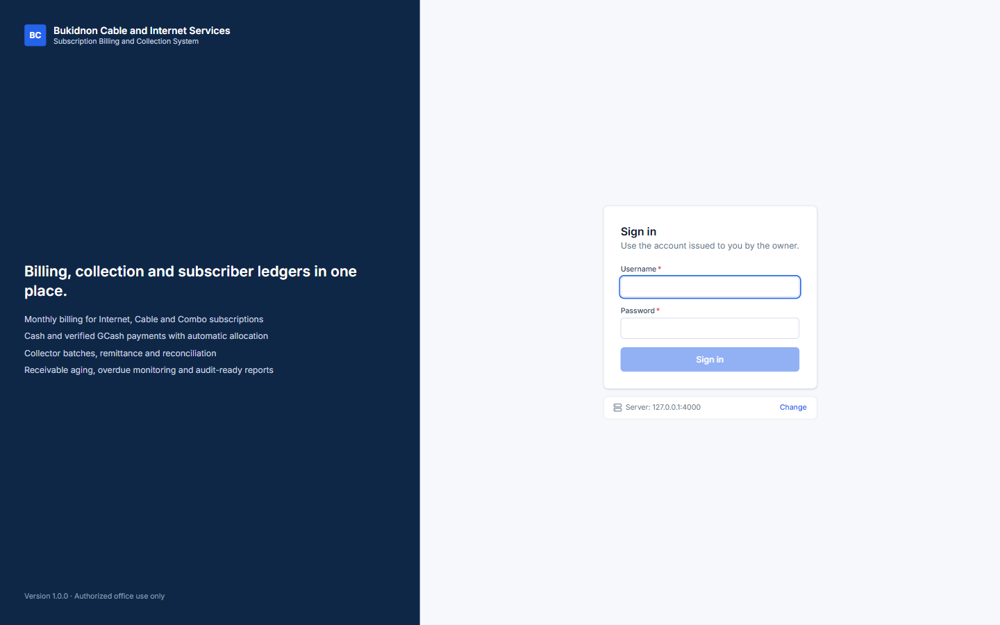

* After several wrong passwords the account is locked for a few minutes. Wait, or ask the owner to reset your password.
* **Server: … Change** under the form shows which server PC this computer talks to. Only change it when told to (see Troubleshooting).

## 1.2 The screen

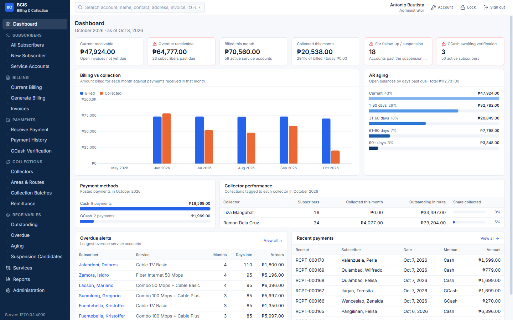

* **Left menu** — only the items your role may use are shown.
* **Search box (Ctrl+K)** — finds a subscriber by account number, name, contact number or address, and also invoice numbers, receipt numbers and GCash reference numbers.
* **Top right** — your name and role, **Account** (change your password), **Lock** and **Sign out**.

## 1.3 Locking and signing out

* Click **Lock** when you step away. The session also locks by itself after a period without activity. Type your password to continue.
* Click **Sign out** at the end of your shift. Never share your account: every action is recorded under your name.

## 1.4 Reading the tables

Every list works the same way: type in the search box, choose filters, click a column heading to sort, use the arrows at the bottom to change page, and click **CSV** to export the rows shown. Click a row to open it.

Amounts are in Philippine pesos. Statuses always show a word as well as a colour, for example **Overdue**, **Partially Paid**, **Shortage**.

# 2. Subscribers

## 2.1 Registering a subscriber

1. **Subscribers › New Subscriber**.
2. Fill in name, contact number, due day (1–28), collection area and collector, and the address. Fields marked **\*** are required; mistakes are shown under the field.
3. Optionally choose the **first service account** (plan and activation date).
4. Click **Register subscriber**. The account number (for example `BCIS-00051`) is assigned automatically.

## 2.2 The subscriber profile

Open a subscriber from **All Subscribers** or from the search box.

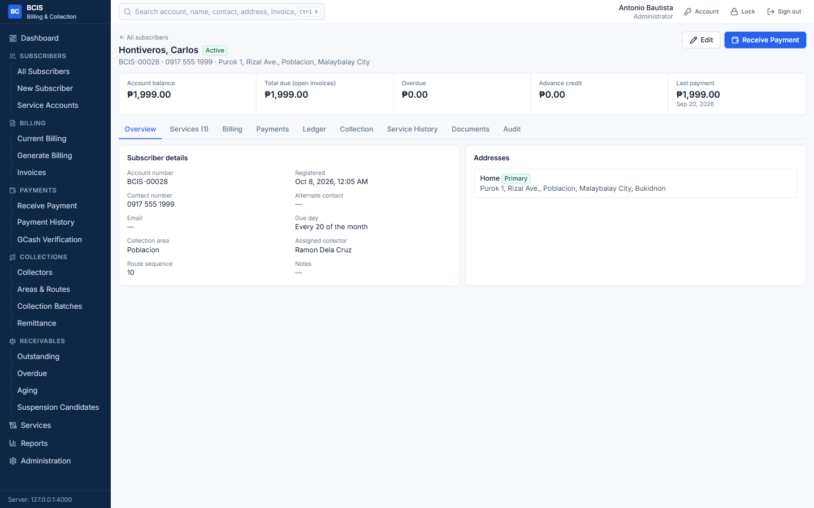

| Tab | What it shows |
|---|---|
| Overview | Contact details, collection assignment, addresses |
| Services | Service accounts; add a service, change plan, suspend, reconnect, terminate |
| Billing | Invoices; click one for its lines, payments and adjustments |
| Payments | Receipts; click one to print it again or (if allowed) reverse it |
| Ledger | Every debit and credit with the running balance; Statement of Account |
| Collection | Collector visits and what was collected |
| Service History | Activations, plan changes, suspensions, reconnections |
| Documents | GCash proofs on file |
| Audit | Who changed what on this subscriber (authorized roles) |

A subscriber is never deleted. To close an account, terminate its services, then use **Edit › Status** and give the reason.

## 2.3 Adding a service account

Profile › **Services › Add service**. Choose the plan, the installation address (or enter another one), activation date, billing start date and due day. A subscriber may have several services at different addresses.

# 3. Billing

## 3.1 Generating the monthly billing

1. **Billing › Generate Billing**. Choose the billing period.
2. The preview shows how many service accounts will be billed, how many are already billed (skipped) and the total.
3. Choose **Generate and finalize** (normal) or **Create drafts for review**.
4. Click **Generate**.

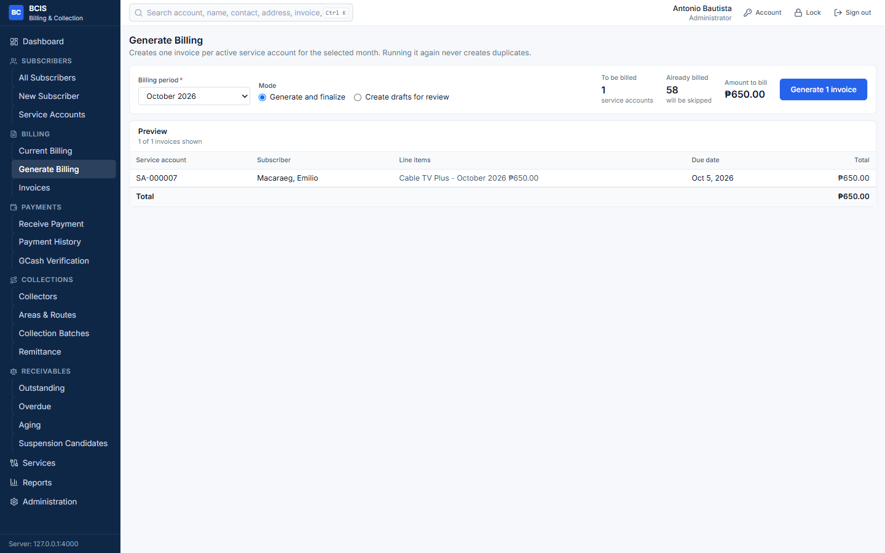

* It is safe to run the generation again: accounts that already have an invoice for the month are skipped, so no duplicates are created.
* Drafts are not yet in the ledger. Review them under **Invoices**, then **Finalize drafts** or **Discard drafts**.
* If a subscriber has advance credit, it is applied to the new invoice automatically.

## 3.2 Invoices

**Billing › Invoices** lists all invoices. Click one to see the details.

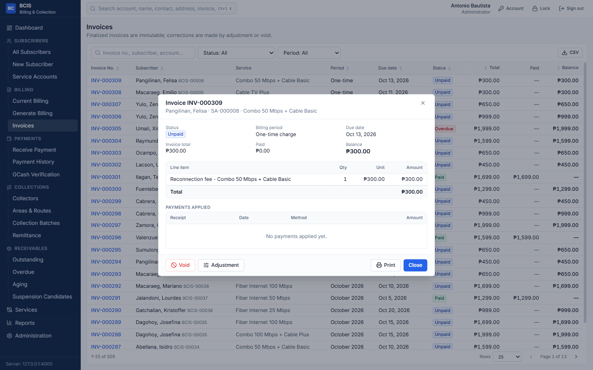

A finalized invoice cannot be edited. To correct it:

* **Adjustment** — add a credit (reduce the balance, for example a rebate) or a debit (add a charge). A reason is required.
* **Void** — cancel the whole invoice. Not possible while payments are applied to it; reverse those payments first.

# 4. Payments

## 4.1 Receiving a payment

1. **Payments › Receive Payment**. Type the subscriber's name or account number and press Enter.
2. Check the name, **Total due** and **Overdue**.
3. Type the **amount received**, or click **Total due** / **Overdue only**.
4. Choose the payment method. A reference number is required for anything other than cash.
5. Read the **Allocation preview**: it shows which invoices the money goes to (oldest first) and what remains.
6. Click **Post payment** (or press Ctrl+Enter), then **Print receipt**.

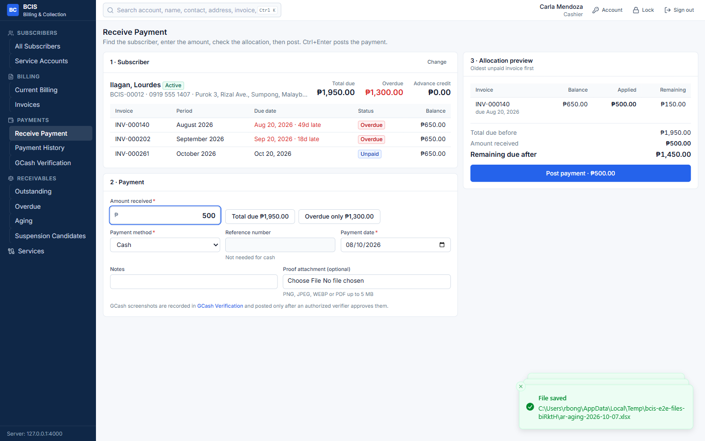

* **Paying less than the bill** leaves the invoice *Partially Paid* with the remaining balance.
* **Paying more than the bill** — the extra is kept as **advance credit** and used automatically for the next invoices. The preview tells you how much.

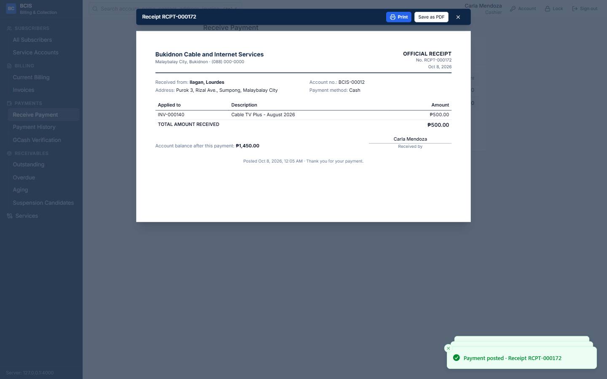

## 4.2 Correcting a wrong payment

A posted payment cannot be edited or deleted. If it is wrong, an authorized user opens it in **Payment History**, clicks **Reverse payment** and types the reason. The original payment stays in the list marked *Reversed*, the receipt becomes *Void*, the balances go back, and the correct payment is posted as a new receipt.

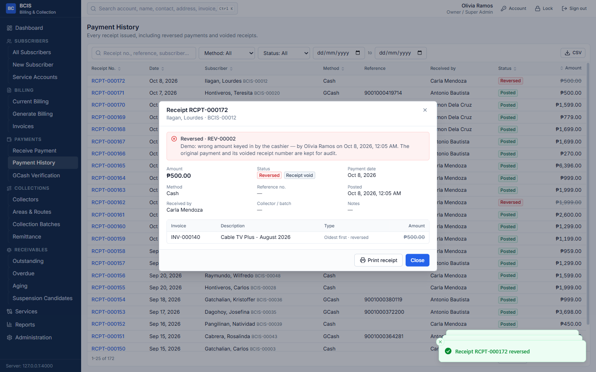

# 5. GCash Verification

A GCash screenshot is **evidence to check**, not proof of payment. The account is credited only after verification.

**Recording a proof (cashier):**

1. **Payments › GCash Verification › Record GCash proof**.
2. Find the subscriber, type the reference number, sender name and number, amount and date, and attach the image.
3. Click **Submit for verification**. Nothing is posted yet.

**Verifying (administrator / owner):**

1. Open the **Pending** list and click a proof. The image is on the left, the details on the right.
2. Check the reference number, amount and date in the GCash app or merchant history.
3. Click **Verify and post**, or **Reject** with a reason.

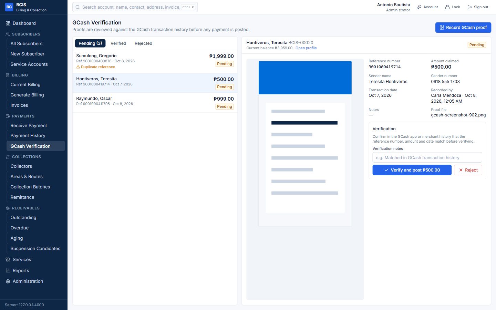

If the same reference number was already used, the proof shows **Duplicate reference**. When that reference already has a posted payment, verification is blocked.

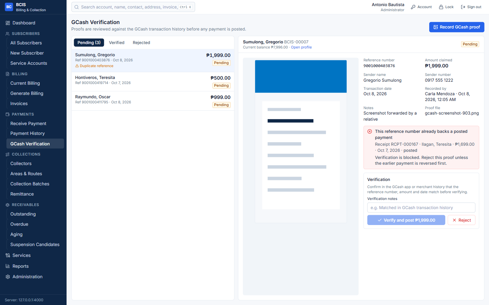

# 6. House-to-House Collection

## 6.1 Setting up

* **Collections › Areas & Routes** — the collection areas, route notes and a printable **route sheet** per collector.
* **Collections › Collectors** — collectors and the areas assigned to them.
* Each subscriber's area and collector are set in the subscriber's profile.

## 6.2 Running a collection batch

1. **Collections › Collection Batches › New Batch**. Choose the collector, area and date. The batch loads every assigned subscriber with an amount due.
2. Print the **Route sheet** for the collector.
3. When the collector returns, open the batch and click **Collect** beside each subscriber who paid; enter the amount and method. Use **No payment…** for *Not at home*, *Promised to pay* or *Refused*.
4. Click **Submit batch**.

## 6.3 Remittance and reconciliation

Open the batch from **Collections › Remittance**.

1. Count the cash the collector turns over, type it under **Cash amount counted** and click **Record remittance**.
2. The screen compares **cash collected** with **cash remitted**:
   * equal — click **Reconcile as balanced**;
   * different — the **shortage** or **overage** is shown in red or amber. You must type the reason before you can reconcile. The difference is recorded exactly as it is.
3. An administrator or the owner ticks the confirmation and clicks **Close batch**.

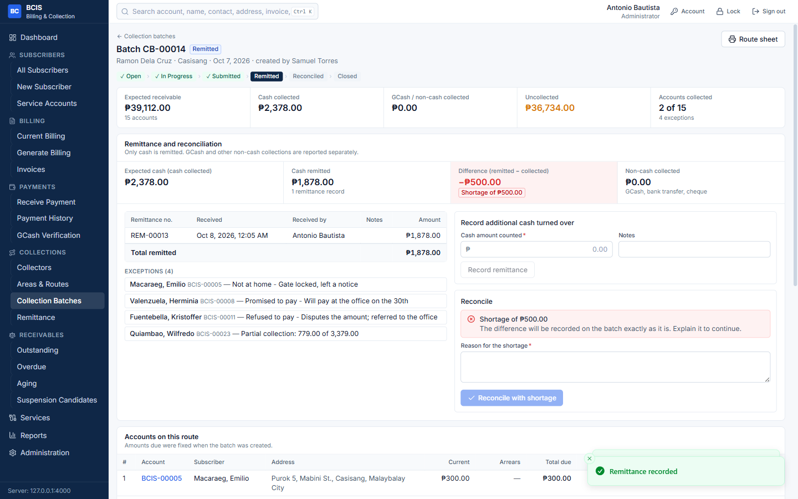

GCash and other non-cash collections are listed separately and are not part of the cash to remit.

# 7. Receivables

| Screen | Use it to |
|---|---|
| Outstanding | See every subscriber with a balance, current and overdue |
| Overdue | Follow up past-due accounts: months unpaid, oldest invoice, last payment, total arrears. Filter by collector, area, plan, service and age |
| Aging | See balances in Current, 1–30, 31–60, 61–90 and 90+ day columns. The green line confirms the total equals all open invoices |
| Suspension Candidates | Accounts that passed the grace period and threshold |

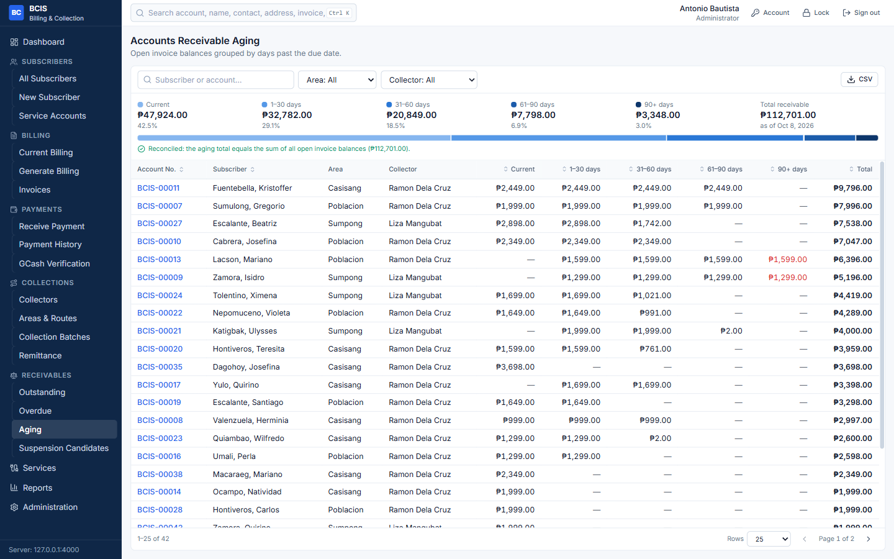

# 8. Suspension and Reconnection

1. **Receivables › Suspension Candidates › Suspend** (or from the profile's Services tab). Enter the reason and effective date. Suspended accounts are not billed.
2. When the subscriber has settled the overdue invoices, click **Reconnect** on the service. A reconnection fee invoice is created if the plan has one. Assign a technician.
3. The technician opens **Services › Reconnections** and clicks **Mark completed** after restoring the line. The account becomes Active again.

# 9. Reports

1. **Reports**. Choose a report on the left.
2. Set the dates or other options and click **Run report**.
3. Click **Print**, **PDF**, **XLSX** or **CSV**.

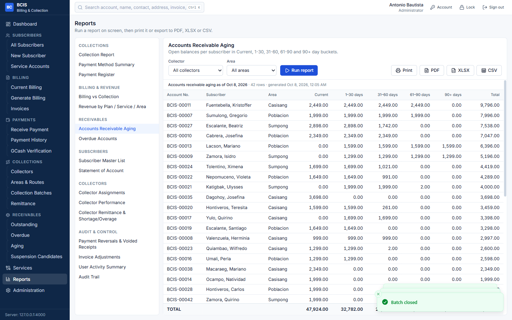

Available reports: Collection Report (daily, weekly, monthly, annual), Payment Method Summary, Payment Register, Billing vs Collection, Revenue by Plan / Service / Area, AR Aging, Overdue Accounts, Subscriber Master List, Statement of Account, Collector Assignments, Collector Performance, Collector Remittance and Shortage/Overage, Payment Reversals and Voided Receipts, Invoice Adjustments, User Activity and Audit Trail.

The **Statement of Account** can also be printed from a subscriber's **Ledger** tab.

# 10. Administration (Owner)

| Tab | Use |
|---|---|
| Users | Create users, assign roles, deactivate, reset a password |
| Roles & Permissions | See exactly what each role may do |
| Settings | Company details on receipts, grace period, suspension threshold, penalty, lockout and idle-lock times |
| Audit Log | Every recorded action; click a row to see before and after values |
| Backup & Restore | Create and verify backups, restore, run the integrity check |

## 10.1 Backup

1. **Administration › Backup & Restore › Create backup now**.
2. Click **Verify** beside the new backup. Status becomes *Verified*.
3. Copy the folder `data\backups` on the server PC to an external drive regularly.

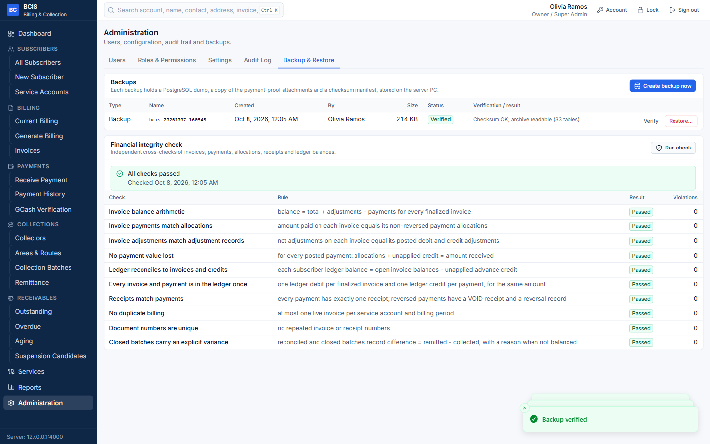

## 10.2 Restore

Restoring replaces **all** current data with the backup. Use it only after data loss or a serious mistake.

1. Make sure no one else is using the system.
2. Click **Restore…** beside a verified backup, type the reason and the word `RESTORE`.
3. The system verifies the backup, saves a safety copy of the current data, restores, and runs the integrity check. Read the result shown at the top.
4. Other users sign in again.

# 11. Troubleshooting

| Problem | What to do |
|---|---|
| "Cannot reach the BCIS server" | Check the network cable / Wi-Fi. Make sure the server PC is on. On the sign-in screen click **Change**, check the server address and click **Test connection**. |
| "Incorrect username or password" | Check Caps Lock. After several tries the account locks for some minutes. Ask the owner to reset the password. |
| "Your session has expired" | Sign in again. Sessions end after 12 hours or when the owner changes your account. |
| "You do not have permission" / a menu is missing | Your role does not include that task. Ask the owner. |
| A payment was posted to the wrong subscriber or with the wrong amount | Do not try to fix it by another entry. Ask an administrator to **reverse** it, then post it correctly. |
| "This service account already has an invoice for that billing period" | The month is already billed for that account. Nothing more to do. |
| "A posted payment already uses this GCash reference number" | The reference was credited before. Check the earlier receipt; reject the duplicate proof. |
| The batch cannot be reconciled | Remitted cash differs from collected cash. Type the reason for the shortage or overage. |
| The receipt did not print | Open the payment in **Payment History** and click **Print receipt**, or **Save as PDF**. |
| Totals look wrong | Owner: **Administration › Backup & Restore › Run check**. All checks should pass; if not, contact the developer and do not restore without advice. |
